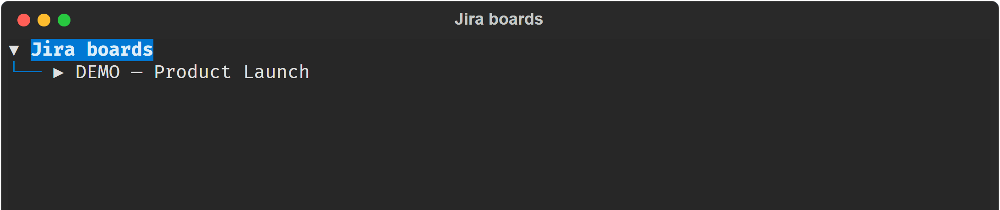
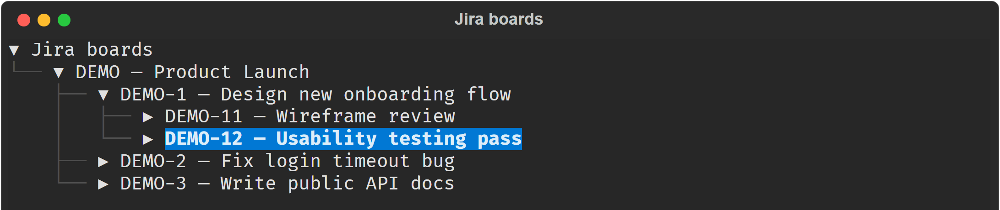

# Jira → Backlog for Claude Code

Turn a Jira Kanban board into a ready-to-work backlog, right from your terminal — plus a real arrow-key tree browser for picking boards and issues without ever leaving your shell.

[](LICENSE)
[](https://github.com/Chang-Jin-Lee/jira-claude-plugin)
[](https://claude.com/claude-code)



## What it does

Point this at a Jira board and it will:

1. Read through every issue on the board, and every subtask underneath them
2. Put it all into one easy-to-read document
3. Turn that document into a prioritized backlog, with acceptance criteria for each item
4. Ask whether you want to jump straight into building it, using the [superpowers](https://github.com/obra/superpowers) skill pack

It also ships a **standalone terminal tree browser** — a real, arrow-key-navigable
view of your boards and issues — for the times you'd rather browse and pick
than type a board key from memory.

## Why

Reading through a whole board's epics, stories, and subtasks just to write a
spec is repetitive busywork. This plugin does the reading for you, so you
can go from "here's our board" to "here's what to build, and in what order"
in one step. And since you rarely remember every board key off the top of
your head, the tree browser lets you find the right one visually instead of
guessing.

## Requirements

- [Claude Code](https://claude.com/claude-code)
- A Jira Cloud site, with your account email and an API token
- [uv](https://docs.astral.sh/uv/) installed on your machine (used to run the Jira connector and the tree browser)

### Get a Jira API token

1. Go to your Atlassian account's [API token page](https://id.atlassian.com/manage-profile/security/api-tokens)
2. Create a token and copy it — it's only shown once

## Install

```
/plugin marketplace add Chang-Jin-Lee/jira-claude-plugin
/plugin install jira-claude-plugin
```

Type each line exactly as shown, in one go. If you instead run `/plugin`
with no arguments and use the interactive menu, its "Enter marketplace
source" field wants just `Chang-Jin-Lee/jira-claude-plugin` — don't type
`marketplace add` again in there, or Claude Code will treat the whole
string as the repo path and reject it.

The first time you use it, Claude Code will ask for your Jira site URL,
your account email, and the API token you created above. These are stored
securely on your machine — never in this repo, never in plain text.

## Browse boards and issues in a real terminal tree

Every session prints a one-line hint like this:

```
보드/이슈를 화살표키로 탐색하려면 새 터미널에서 다음을 실행하세요:
uv run --with textual,requests "<plugin path>/scripts/browse_tree.py"
```

Run it in any plain terminal (outside Claude Code) and you get a live tree:
boards at the top, lazily expanding into their issues and subtasks as you
navigate — no upfront full-board fetch, so it stays snappy even on large
boards.

- `→` expands the node under the cursor (fetches its children on first expand)
- `←` collapses it back up
- `Enter` copies the selected key to your clipboard and exits

Paste that key straight into `/jira-claude-plugin:jira-to-backlog` back in
Claude Code, and it skips straight to crawling that one issue.



## Usage

Just ask, in your own words:

> "지라 KAN 보드 문서화해서 백로그 만들어줘"
> "Turn our Jira board APP into a backlog"

Or invoke it directly:

```
/jira-claude-plugin:jira-to-backlog KAN
```

If you don't name a board, Claude will list the boards you have access to
and let you pick one — or paste in a key from the tree browser above.

## Example

```
> /jira-claude-plugin:jira-to-backlog KAN

⏺ jira-claude-plugin:jira-to-backlog
  Checking Jira connection... ✓ connected

  Reading KAN-101 ... KAN-114 ... KAN-115 ... (42 top-level issues)
  Crawling subtasks ... 118 issues total, visited-set deduped

  ✓ Wrote jira-docs/KAN.md          (118 issues, epic → story → subtask)
  ✓ Wrote jira-docs/KAN-backlog.md  (94 open items, 24 Done skipped)

  superpowers isn't installed yet — install it now and start
  brainstorming from this backlog? (y/n)
```

## What you get

Two files, saved into your current project:

- `jira-docs/<BOARD>.md` — the whole board in one document, one section per
  issue, nested to match epic → story → subtask
- `jira-docs/<BOARD>-backlog.md` — a prioritized backlog built from that
  document, with acceptance criteria per item

Once those are ready, Claude will ask whether you'd like to start working
through the backlog with [superpowers](https://github.com/obra/superpowers)
— offering to install it first if you don't already have it.

## Troubleshooting

**"Failed to connect" on the atlassian MCP server right after installing `uv`.**
`uv`'s installer updates your PATH, but any terminal window (or terminal app)
that was already open won't see the change — including one where you just
ran `/plugin install`. Reopening a tab in the same terminal app usually
isn't enough either, since many terminal apps keep one long-running host
process behind the scenes. Fully quit the terminal application (all its
windows) and open a brand new one — or just restart your computer once —
then launch Claude Code again. This is only needed the one time right after
installing `uv`; every launch after that picks up the right PATH
automatically.

**Tree browser prints "자격증명 파일이 없습니다".** Its credentials file is
synced by a hook that runs once per Claude Code session start. Start (or
restart) a Claude Code session in this plugin's install with Jira configured
via `/plugin`, then run the browser again.

## License

MIT
