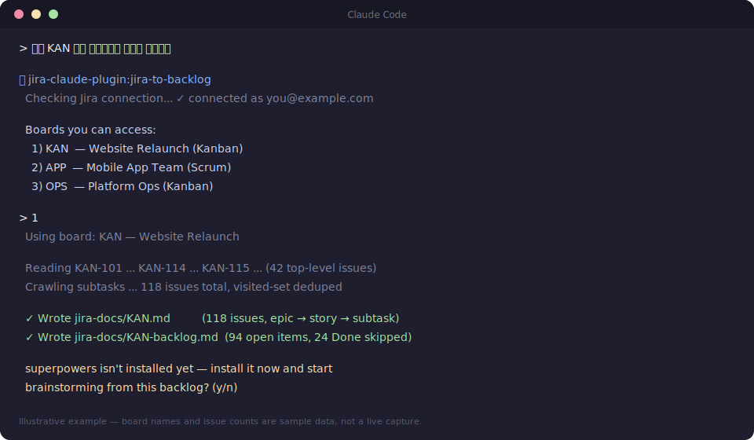

# Jira → Backlog for Claude Code

Turn a Jira Kanban board into a ready-to-work backlog, right from your terminal.

## What it does

Point this at a Jira board and it will:

1. Read through every issue on the board, and every subtask underneath them
2. Put it all into one easy-to-read document
3. Turn that document into a prioritized backlog, with acceptance criteria for each item
4. Ask whether you want to jump straight into building it, using the [superpowers](https://github.com/obra/superpowers) skill pack

## Why

Reading through a whole board's epics, stories, and subtasks just to write a
spec is repetitive busywork. This plugin does the reading for you, so you
can go from "here's our board" to "here's what to build, and in what order"
in one step.

## Requirements

- [Claude Code](https://claude.com/claude-code)
- A Jira Cloud site, with your account email and an API token
- [uv](https://docs.astral.sh/uv/) installed on your machine (used to run the Jira connector)

### Get a Jira API token

1. Go to your Atlassian account's [API token page](https://id.atlassian.com/manage-profile/security/api-tokens)
2. Create a token and copy it — it's only shown once

## Install

```
/plugin marketplace add Chang-Jin-Lee/jira-claude-plugin
/plugin install jira-claude-plugin
```

Type each line exactly as shown, in one go. If you instead run `/plugin`
with no arguments and use the interactive menu, its "Enter marketplace
source" field wants just `Chang-Jin-Lee/jira-claude-plugin` — don't type
`marketplace add` again in there, or Claude Code will treat the whole
string as the repo path and reject it.

The first time you use it, Claude Code will ask for your Jira site URL,
your account email, and the API token you created above. These are stored
securely on your machine — never in this repo, never in plain text.

## Usage

Just ask, in your own words:

> "지라 KAN 보드 문서화해서 백로그 만들어줘"
> "Turn our Jira board APP into a backlog"

Or invoke it directly:

```
/jira-claude-plugin:jira-to-backlog KAN
```

If you don't name a board, Claude will list the boards you have access to
and let you pick one.

## Example

Ask in natural language, pick a board, and it takes it from there:



## What you get

Two files, saved into your current project:

- `jira-docs/<BOARD>.md` — the whole board in one document, one section per
  issue, nested to match epic → story → subtask
- `jira-docs/<BOARD>-backlog.md` — a prioritized backlog built from that
  document, with acceptance criteria per item

Once those are ready, Claude will ask whether you'd like to start working
through the backlog with [superpowers](https://github.com/obra/superpowers)
— offering to install it first if you don't already have it.

## License

MIT
