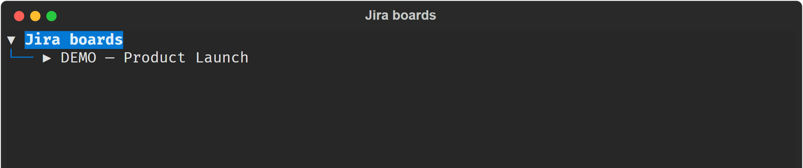
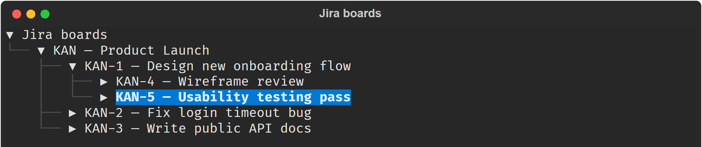

# Jira → Backlog for Claude Code & Codex CLI

Turn a Jira Kanban board into a ready-to-work backlog, right from your terminal — plus a real arrow-key tree browser for picking boards and issues without ever leaving your shell.

[](LICENSE)
[](https://github.com/Chang-Jin-Lee/jira-claude-plugin)
[](https://claude.com/claude-code)
[](CONTRIBUTING.md)
[](https://github.com/Chang-Jin-Lee/jira-claude-plugin/issues)



## Table of contents

- [What it does](#what-it-does)
- [Why](#why)
- [Requirements](#requirements)
  - [Get a Jira API token](#get-a-jira-api-token)
- [Install](#install)
  - [Claude Code](#claude-code)
  - [Codex CLI](#codex-cli)
- [Browse boards and issues in a real terminal tree](#browse-boards-and-issues-in-a-real-terminal-tree)
- [Usage](#usage)
- [Example](#example)
- [What you get](#what-you-get)
- [Troubleshooting](#troubleshooting)
- [Contributing](#contributing)
- [License](#license)

## What it does

Point this at a Jira board and it will:

1. Read through every issue on the board, and every subtask underneath them
2. Put it all into one easy-to-read document
3. Turn that document into a prioritized backlog, with acceptance criteria for each item
4. Ask whether you want to jump straight into building it, using the [superpowers](https://github.com/obra/superpowers) skill pack

It also ships a **standalone terminal tree browser** — a real, arrow-key-navigable
view of your boards and issues — for the times you'd rather browse and pick
than type a board key from memory.

## Why

Reading through a whole board's epics, stories, and subtasks just to write a
spec is repetitive busywork. This plugin does the reading for you, so you
can go from "here's our board" to "here's what to build, and in what order"
in one step. And since you rarely remember every board key off the top of
your head, the tree browser lets you find the right one visually instead of
guessing.

## Requirements

- [Claude Code](https://claude.com/claude-code) or [Codex CLI](https://developers.openai.com/codex)
- A Jira Cloud site, with your account email and an API token
- [uv](https://docs.astral.sh/uv/) — runs the Jira connector and the tree browser. In Claude Code the plugin installs it for you on first run if it's missing; see [Install](#install)

### Get a Jira API token

1. Go to your Atlassian account's [API token page](https://id.atlassian.com/manage-profile/security/api-tokens)
2. Create a token and copy it — it's only shown once

## Install

### Claude Code

Run these **one at a time** — paste the first line, press Enter, wait for it
to finish, then paste the second. Sending both at once makes Claude Code read
the second line as an argument to the first and reject it:

```
/plugin marketplace add Chang-Jin-Lee/jira-claude-plugin
```

```
/plugin install jira-claude-plugin
```

If you instead run `/plugin` with no arguments and use the interactive menu,
its "Enter marketplace source" field wants just
`Chang-Jin-Lee/jira-claude-plugin` — don't type `marketplace add` again in
there, or Claude Code will treat the whole string as the repo path and
reject it.

Claude Code then asks for your Jira site URL, your account email, and the
API token you created above. These are stored securely on your machine —
never in this repo, never in plain text.

Now start a new session and just ask for your board — there is nothing else
to install by hand.

The plugin needs [uv](https://docs.astral.sh/uv/) and a ~150 MB Jira server
package. The first time you run it, if either is missing, it sets them up for
you: uv goes in with the official per-user installer (no administrator
rights), the server package downloads in the background, and you'll be told
to fully quit your terminal application and start Claude Code again from a
new one. That restart is unavoidable — uv's installer edits your PATH, and
a program that is already running never sees that change. After it, every
session is ready the moment it opens.

You only ever enter your Jira settings once. If you're ever asked for them
again, that's a bug — see [Troubleshooting](#troubleshooting).

Prefer to do it yourself, or on a machine that can't reach `astral.sh`? Run
these in a normal terminal before installing the plugin, then fully quit and
reopen the terminal:

```
winget install --id=astral-sh.uv -e
uvx mcp-atlassian --version
```

macOS/Linux: `curl -LsSf https://astral.sh/uv/install.sh | sh` instead of the
`winget` line. Setting `JIRA_PLUGIN_NO_BOOTSTRAP=1` stops the plugin from
installing anything on its own; `JIRA_PLUGIN_UV_INSTALLER` replaces the
install command outright, for an internal mirror.

### Codex CLI

```
codex plugin marketplace add Chang-Jin-Lee/jira-claude-plugin
codex plugin add jira-claude-plugin@jira-claude-plugin
```

Codex plugins don't have an interactive secret-entry screen yet, so set
these three environment variables yourself before first use (e.g. in
`~/.zshrc` or `~/.bashrc`), then start a new Codex session:

```
export JIRA_URL="https://your-domain.atlassian.net"
export JIRA_USERNAME="you@example.com"
export JIRA_API_TOKEN="<the token you created above>"
```

## Browse boards and issues in a real terminal tree

Every session prints a one-line hint like this:

```
보드/이슈를 화살표키로 탐색하려면 새 터미널에서 다음을 실행하세요:
uv run --with textual,requests "<plugin path>/scripts/browse_tree.py"
```

Run it in any plain terminal (outside Claude Code) and you get a live tree:
boards at the top, lazily expanding into their issues and subtasks as you
navigate — no upfront full-board fetch, so it stays snappy even on large
boards.

- `→` expands the node under the cursor (fetches its children on first expand)
- `←` collapses it back up
- `Enter` copies the selected key to your clipboard and exits

Paste that key straight into `/jira-claude-plugin:jira-to-backlog` back in
Claude Code, and it skips straight to crawling that one issue. On Codex CLI
(or any shell where the session hint above never printed), run the exact
same `uv run --with textual,requests scripts/browse_tree.py` command
yourself after exporting `JIRA_URL` / `JIRA_USERNAME` / `JIRA_API_TOKEN` —
see Install above.



## Usage

Just ask, in your own words:

> "지라 KAN 보드 문서화해서 백로그 만들어줘"
> "Turn our Jira board APP into a backlog"

Or invoke it directly:

```
/jira-claude-plugin:jira-to-backlog KAN
```

If you don't name a board, Claude will list the boards you have access to
and let you pick one — or paste in a key from the tree browser above.

## Example

```
> /jira-claude-plugin:jira-to-backlog KAN

⏺ jira-claude-plugin:jira-to-backlog
  Checking Jira connection... ✓ connected

  Reading KAN-101 ... KAN-114 ... KAN-115 ... (42 top-level issues)
  Crawling subtasks ... 118 issues total, visited-set deduped

  ✓ Wrote jira-docs/KAN.md          (118 issues, epic → story → subtask)
  ✓ Wrote jira-docs/KAN-backlog.md  (94 open items, 24 Done skipped)

  superpowers isn't installed yet — install it now and start
  brainstorming from this backlog? (y/n)
```

## What you get

Two files, saved into your current project:

- `jira-docs/<BOARD>.md` — the whole board in one document, one section per
  issue, nested to match epic → story → subtask
- `jira-docs/<BOARD>-backlog.md` — a prioritized backlog built from that
  document, with acceptance criteria per item

Once those are ready, Claude will ask whether you'd like to start working
through the backlog with [superpowers](https://github.com/obra/superpowers)
— offering to install it first if you don't already have it.

## Troubleshooting

Start here — find the message you actually saw:

| What you see | What it means | What to do |
|---|---|---|
| `hook error: Executable not found in $PATH: "uv"` | Expected on a machine that has never had `uv`. The plugin can't run anything yet. | Just ask for your board. The skill installs `uv`, starts the server download, and tells you when to restart. |
| `hook error: Executable not found in $PATH: "sh"` | A bug in 0.1.11–0.1.12, which registered a hook that doesn't exist on Windows without Git Bash. | `/plugin update` (0.1.13 removed it). |
| `uv는 이미 설치돼 있지만 …터미널이 그걸 못 보고 있습니다` | `uv` is installed but this terminal predates it, so it can't see the new PATH. | Fully quit the terminal **application**, not just the window, and start Claude Code from a new one. Don't reinstall. |
| `Jira 서버 패키지…를 처음 내려받는 중입니다` | The ~150 MB server package is still downloading; Claude Code only waits 30 s for a server. | Let it finish, then `/mcp` → reconnect `atlassian`. Once only. |
| `Jira 설정이 아직 없습니다` | No Jira URL / email / token stored yet. | `/plugin`, fill the three fields. Closing it reconnects the server for you. |
| `이전에 실패로 표시돼…초기화했습니다` | The plugin just undid a stale failure flag (see below). | Nothing, or `/mcp` reconnect to use it immediately. |
| `atlassian` listed as needing authentication | It never means authentication here — this plugin uses no OAuth. It means the server failed to start. | See the next section. |
| Tree browser: `Jira 자격증명을 찾을 수 없습니다` | It reads a file written at Claude Code session start, or `JIRA_*` env vars. | Start one Claude Code session with Jira configured, then rerun it — or export `JIRA_URL` / `JIRA_USERNAME` / `JIRA_API_TOKEN`. |

One thing worth knowing, because it surprises people: **when an MCP server
fails to start, Claude Code remembers and stops starting it in later sessions
too.** Restarting doesn't clear that — only reconnecting does. So a single
early failure (no `uv` yet, package still downloading) can look like a
permanent breakage. The plugin clears that flag for its own server as soon as
the setup is healthy, so at worst you reconnect once.

**"Failed to connect" on the atlassian MCP server right after installing `uv`.**
`uv`'s installer updates your PATH, but any terminal window (or terminal app)
that was already open won't see the change — including one where you just
ran `/plugin install`. Reopening a tab in the same terminal app usually
isn't enough either, since many terminal apps keep one long-running host
process behind the scenes. Fully quit the terminal application (all its
windows) and open a brand new one — or just restart your computer once —
then launch Claude Code again. This is only needed the one time right after
installing `uv`; every launch after that picks up the right PATH
automatically.

**The `atlassian` server shows up as needing authentication, or asks you to
re-enter Jira settings you already entered.** This plugin uses no OAuth —
there is nothing to authenticate. That label means the server failed to
start. Your saved settings are almost certainly fine; re-entering them won't
help. Two causes, in order of likelihood:

1. *First run on a new machine.* `uv` or the ~150 MB server package wasn't
   ready, and Claude Code only waits 30 seconds for a server to start. Worse,
   it remembers the failure and stops starting that server in later sessions,
   which is why restarting on its own doesn't help. Reconnect `atlassian` once
   from `/mcp` and you're set — the plugin clears that flag itself as soon as
   the setup is complete, so it shouldn't happen twice.
2. *You just entered your Jira settings.* The server started before they
   existed. Claude Code reconnects the plugin when you close `/plugin`; if it
   doesn't, start a new session.
3. *Version 0.1.9 or older.* The Jira connection and the credential-sync hook
   started at the same time and the connection could read the credentials file
   mid-write, which broke sessions at random. Run `/plugin update`.

**Every session opens with `hook error: Executable not found in $PATH: "sh"`.**
Versions 0.1.11 and 0.1.12 registered a `sh` hook, which doesn't exist on
Windows machines without Git Bash. Run `/plugin update` — 0.1.13 removed it.

**Tree browser prints "자격증명을 찾을 수 없습니다".** In Claude Code, its
credentials file is synced by a hook that runs once per session start —
start (or restart) a Claude Code session in this plugin's install with Jira
configured via `/plugin`, then run the browser again. Running it from Codex
CLI or a plain shell instead? Make sure `JIRA_URL` / `JIRA_USERNAME` /
`JIRA_API_TOKEN` are exported in that shell, then run the browser again.

## Contributing

Bug reports, doc fixes, and small PRs are genuinely welcome — this started
as a one-person itch-scratch and gets better the more real Jira setups it's
tried against. See [CONTRIBUTING.md](CONTRIBUTING.md) for the project
layout, how to run the tests, and a few real gotchas (version bumps, hook
wiring, credential handling) worth knowing before you dive in.

## License

MIT
